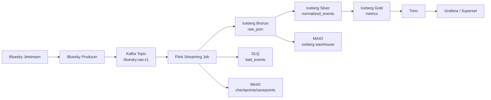
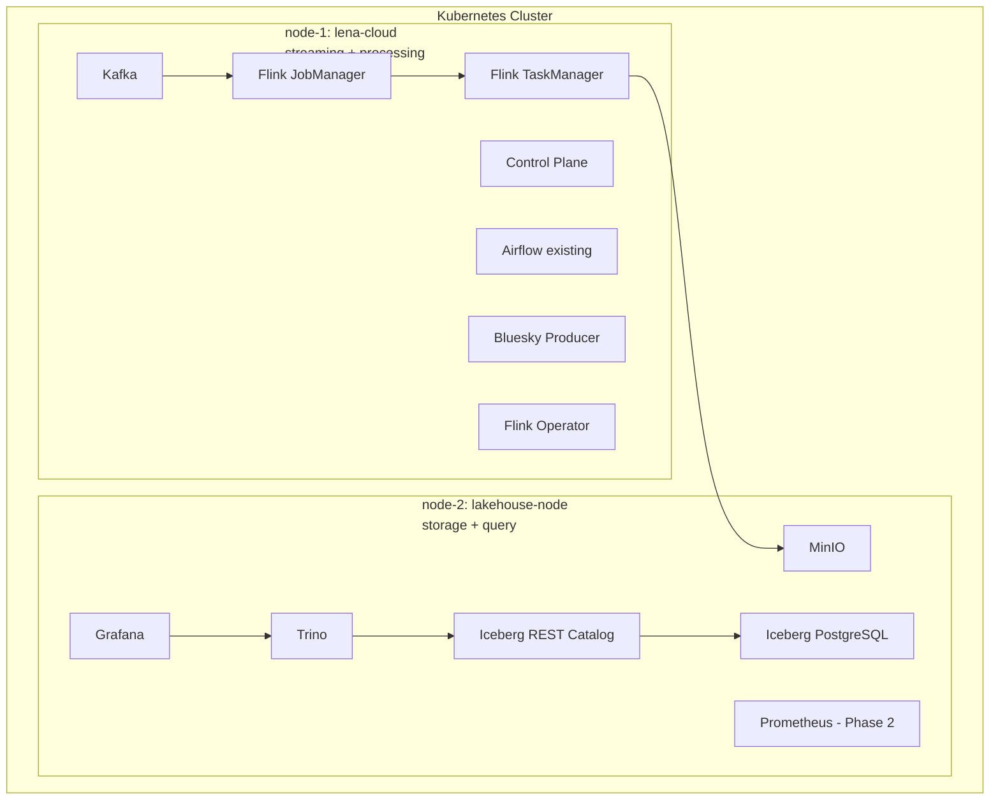
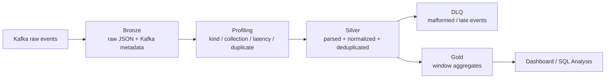

# 아키텍처

## Overview

SkyLake는 Bluesky Jetstream 이벤트를 수집하고 Iceberg 기반 Lakehouse에 저장하는 실시간 데이터 파이프라인이다.

첫 번째 마일스톤은 의도적으로 좁게 잡는다. raw event를 Iceberg Bronze 테이블에 안정적으로 저장하는 것이 우선이다. 충분한 raw 데이터가 쌓인 뒤, profiling query를 통해 Silver와 Gold 처리 규칙을 결정한다.

## High-Level Architecture



## 컴포넌트 역할

### Bluesky Jetstream

Bluesky Jetstream은 실시간 이벤트 소스다. 이벤트는 JSON record이며, 구조는 이벤트 타입에 따라 다르다.

이 프로젝트에서는 Jetstream을 실제적인 semi-structured social event stream으로 사용한다.

### Bluesky Producer

Producer는 Jetstream WebSocket에 연결해 raw event를 streaming broker로 전송한다.

책임:

- WebSocket 연결 유지
- 장애 시 재연결
- raw JSON 보존
- producer-side metadata 추가
- `bluesky.raw.v1` topic에 write
- 기본 ingestion metric 로그 기록

초기 단계에서 Producer는 무거운 normalization을 수행하지 않는다.

### Kafka

Broker는 Producer와 Flink 사이에서 raw event를 버퍼링한다.

이 계층을 두는 이유:

- ingestion과 processing을 분리한다.
- Flink의 일시적 중단을 흡수한다.
- retention window 안에서 replay를 지원한다.
- consumer lag를 운영 지표로 활용할 수 있다.

초기 topic:

```text
bluesky.raw.v1
```

초기 배포는 Kafka broker 1개로 시작한다. 3-broker 구성은 클러스터가 최소 3개의 물리 또는 가상 노드를 갖춘 뒤로 미룬다.

### Flink

Flink는 streaming processor다.

초기 job:

```text
Kafka raw topic
  -> Flink bronze ingest job
  -> Iceberg Bronze table
```

이후 job에서 다음 기능을 추가한다.

- JSON parsing
- event-time extraction
- watermarking
- stateful deduplication
- late event routing
- DLQ handling
- windowed Gold aggregation

Flink checkpoint와 savepoint는 MinIO에 저장한다.

```text
s3://flink-checkpoints
s3://flink-savepoints
```

### Apache Iceberg

Iceberg는 Lakehouse의 table format이다.

Iceberg를 사용하는 이유:

- schema evolution
- partition evolution
- snapshot management
- time travel
- Flink 및 Trino와의 호환성
- Bronze 기반 재처리 가능성

### MinIO

MinIO는 S3-compatible object storage를 제공한다.

저장 대상:

- Iceberg warehouse files
- Flink checkpoints
- Flink savepoints

권장 bucket:

```text
iceberg-warehouse
flink-checkpoints
flink-savepoints
```

### Iceberg REST Catalog

REST Catalog는 Iceberg table metadata를 Flink와 Trino에 제공한다.

```text
Flink -> Iceberg REST Catalog -> MinIO
Trino -> Iceberg REST Catalog -> MinIO
```

PostgreSQL은 metadata backend로 사용한다.

### Trino

Trino는 Iceberg table을 조회하기 위한 SQL query engine이다.

사용 목적:

- Bronze profiling
- Silver validation
- Gold table query
- dashboard query backend

### Grafana / Superset

Grafana 또는 Superset은 분석 지표와 운영 지표를 시각화한다.

대시보드 후보:

- 분당 이벤트 수
- collection별 이벤트 수
- ingestion latency
- duplicate rate
- late event rate
- DLQ rate
- broker consumer lag
- Flink checkpoint duration

## Kubernetes Node Layout

초기 권장 배포 구조는 2노드 Kubernetes 클러스터다.



### Node 1: Streaming and Processing

`node-1`은 실시간 수집과 stream processing workload를 실행한다.

배치 대상:

- Kubernetes control-plane
- 기존 Airflow workload
- Kafka
- Bluesky Producer
- Flink Operator
- Flink JobManager
- Flink TaskManager

Producer, broker, Flink는 hot streaming path를 구성하므로 초기에는 같은 노드에 배치한다.

### Node 2: Lakehouse, Query, and Observability

`node-2`는 storage, query, observability workload를 실행한다.

배치 대상:

- MinIO
- Iceberg REST Catalog
- Iceberg PostgreSQL
- Trino
- Grafana
- 이후 단계의 Prometheus

이렇게 배치하면 storage/query IO와 streaming/processing path를 분리할 수 있다.

## Namespace Layout

```text
streaming
  - kafka
  - bluesky-producer

processing
  - flink-kubernetes-operator
  - flink jobs

lakehouse
  - minio
  - iceberg-rest
  - iceberg-postgres
  - trino

observability
  - grafana
  - prometheus
```

## Storage Strategy

현재 클러스터는 `local-path` StorageClass를 사용한다. 이는 PVC가 특정 노드의 local disk에 저장된다는 뜻이다.

따라서 stateful workload는 의도한 노드에 고정해야 한다.

초기 배치:

```text
Kafka PVC -> node-1
MinIO PVC             -> node-2
Iceberg PostgreSQL PVC -> node-2
Prometheus PVC        -> node-2
```

Flink state recovery data는 pod-local storage에 의존하면 안 된다. Checkpoint와 savepoint는 MinIO에 저장한다.

## Medallion Data Model



### Bronze

Bronze는 raw event와 ingestion metadata를 보존한다.

후보 컬럼:

```text
raw_json
kafka_topic
kafka_partition
kafka_offset
kafka_timestamp
ingested_at
dt
hour
```

### Silver

Silver는 normalized event를 저장한다.

후보 컬럼:

```text
event_id
dedup_hash
kind
collection
actor_did
event_ts
ingested_at
latency_ms
text
langs
subject_uri
dt
hour
```

Silver 처리 규칙은 Bronze profiling을 통해 결정한다.

### DLQ

DLQ는 안전하게 처리할 수 없는 record를 저장한다.

분리 사유 후보:

- malformed JSON
- 필수 timestamp 누락
- 지나치게 늦게 도착한 event
- 지원하지 않는 event structure

### Gold

Gold는 dashboard-ready aggregate를 저장한다.

후보 테이블:

```text
gold_event_counts_1m
gold_event_counts_1h
gold_daily_active_users
gold_language_trends_1h
```

## 구현 단계

### Phase 1: Bronze Ingestion

목표:

```text
Bluesky Producer -> Broker -> Flink -> Iceberg Bronze
```

완료 기준:

- raw topic에 이벤트가 적재된다.
- Flink가 topic을 consume한다.
- Bronze table을 Trino로 조회할 수 있다.
- 최소 6시간에서 24시간 이상의 데이터를 수집한다.

### Phase 2: Data Profiling

Bronze 데이터를 분석한다.

- 시간대별 event volume
- kind distribution
- collection distribution
- timestamp field availability
- event time vs ingestion time latency
- duplicate key candidate
- malformed event rate
- late event rate

### Phase 3: Silver Normalization

Flink에 다음 처리 로직을 추가한다.

- parsing
- timestamp extraction
- watermarking
- deduplication
- DLQ routing
- late event handling

### Phase 4: Gold Aggregation

분석용 aggregate를 만든다.

- 분당 이벤트 수
- collection별 시간 단위 이벤트 수
- 일별 활성 사용자 수
- 언어별 트렌드
- data quality metric

### Phase 5: Observability and Failure Testing

metric을 추가하고 통제된 장애 실험을 수행한다.

- producer 재시작
- broker 재시작
- Flink TaskManager 종료
- MinIO 일시 중단
- malformed JSON 투입
- late event 투입
- duplicate event 투입

## HA 확장

초기 2노드 구조는 완전한 HA 설계가 아니다. 운영 경험을 쌓고 이후 확장하기 위한 중간 단계다.

세 번째 노드가 추가되면 다음 구성을 고려한다.

- Kafka broker를 3개 노드에 분산 배치한다.
- `replication.factor=3`, `min.insync.replicas=2`를 사용한다.
- 여러 Flink TaskManager를 실행한다.
- Flink JobManager HA를 고려한다.
- Longhorn, distributed MinIO 또는 다른 storage layer로 storage replication을 구성한다.
- Iceberg REST Catalog를 최소 2 replicas로 실행한다.
- PostgreSQL backup 또는 HA를 추가한다.

## 설계 원칙

- raw data를 먼저 보존한다.
- processing policy는 실제 data profiling 결과로 결정한다.
- 첫 번째 마일스톤은 Bronze ingestion으로 작게 유지한다.
- local-path PVC를 사용할 때 stateful workload를 특정 노드에 고정한다.
- Flink checkpoint는 pod-local storage 밖에 저장한다.
- streaming/processing workload와 storage/query workload를 분리한다.
- 파이프라인이 동작하고 운영 병목이 보인 뒤 HA를 추가한다.
